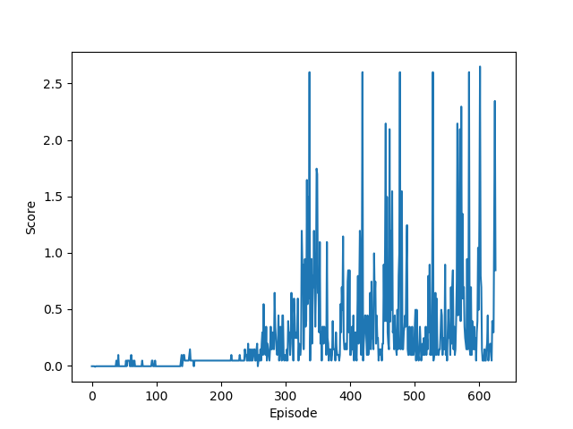

# Report

Encouraged by the results in the [previous project](https://github.com/chrka/drlnd-p2-continuous-control)
I decided to see if I could use the same implementation for this project.
Turns out that it actually worked much better than I could have anticipated!

The agents were trained using Deep Deterministic Policy Gradients (DDPG) 
using shared actor and critic networks, as well as a shared replay buffer.
(This means that I could reuse the multi-agent training code from the
previous project directly and only change a few small things.)

A replay buffer of size 100000 was used from which was drawn random batches of
128 experiences during training. Soft updates between both actor and
critic's local and target networks both mixed in a fraction $\tau=0.005$ of the
local network.

The discount factor $\gamma$ was set to 0.99, and a learning rate $\alpha=0.0005$
was used for both actor and critic.
 
To aid exploration, Orstein-Uhlenbeck noise (with $\sigma=0.10$, $\tau=0.15) was
added to the actors actions when gathering experiences.

After trying out various network architectures of different sizes and shapes,
I eventually settled  on the following:

**Actor network layers:**

| Input | Output | Activation function |
|-------|--------|---------------------|
| States (24) | 256 | ReLU |
| 256 | 128 | Relu |
| 128 | Actions (2) | tanh | 

**Critic network layers:**

| Input | Output | Activation function |
|-------|--------|---------------------|****
| States (24) | 256 | ReLU |
| 256 + Actions (2) | 128 | Relu |
| 128 | Q-value (1)  | Linear | 

The agent solved the task in 455 episodes (that is, managed to keep an average
max score of the agents of more than +0.5 for 100 episodes) in 455 episodes:

## Future improvements

The implementation from the previous project worked surprisingly well, and
hopefully any performance improvements in that project would carry over to this one
as well. 

It would be very interesting to compare other algorithms and see what kind
of behaviour might arise, especially if the two agents use different algorithms.

It would also make sense to tweak the reward function to try and make the
agents behave more natural. For example, adding a penalty for moving might 
induce the agents to exert less energy and work harder on correct positioning.

By accident, I initially trained the agents using their _average_ scores instead 
of their _max_ scores as a stopping criteria which resulted much better interplay
between the agents due to the longer training time, 626 episodes instead of 455:

(The weights are in an earlier commit.)

## Further reading
- [Original Deep DPG paper](https://arxiv.org/abs/1509.02971)
