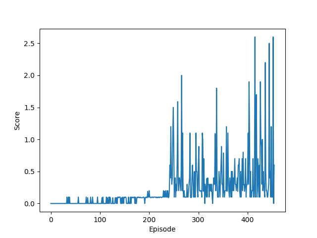

# Report

**REWRITE ALL OF THIS**

The agent was trained using deep Q-learning with soft updates (ie., instead
of fully replacing the target network with the local network, it is moved
towards the local network by a fraction $\tau = 0.001$).

A replay buffer of size 100000 was used from which was drawn random batches of
64 memories during training. Training took place every 4th step.

The discount factor $\gamma$ was set to 0.99, and a learning rate $\alpha$ of
0.0005 was used.

The network used consisted of an input layer from the 37 state variables to 
32 fully connected nodes with ReLU activation functions,
followed by another fully connected hidden layer — also ReLU — of the same
size of 32 nodes. The final output layer used linear activation functions to
the 4 action value outputs.

The agent solves the task in about 1900 episodes.  Here is an example of
the scores achieved per episode using random seed 20190415 where the
task was solved in 1961 episodes:

## Future improvements

Further tweaking of hyper-parameters might prove beneficial; I have mainly
experimented with the $\epsilon$-decay rate, and the size of the neural
network layers.

Using a slightly more sophisticated algorithm would also likely improve the
time taken to solve the task, in particular, using Double DQN to improve the agent's 
estimate of the Q-values, or using Prioritized Experience Replay to make better
use of the replay buffer.

## Further reading
- [Original Deep DPG paper](https://arxiv.org/abs/1509.02971)
